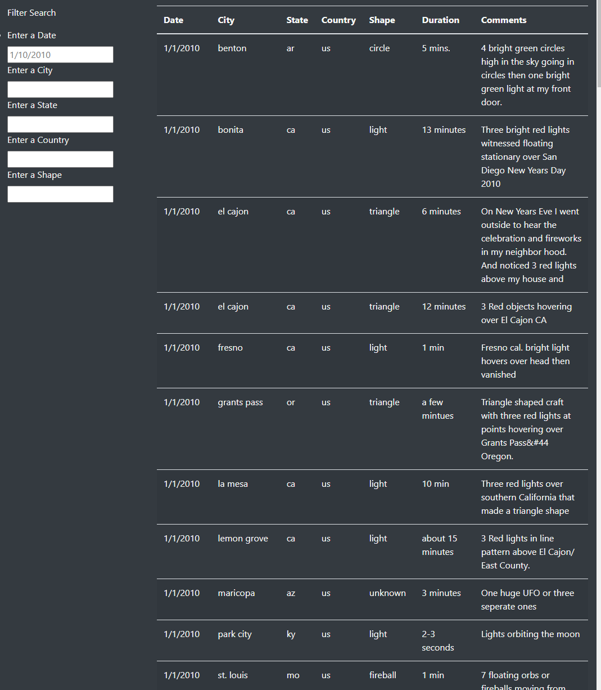
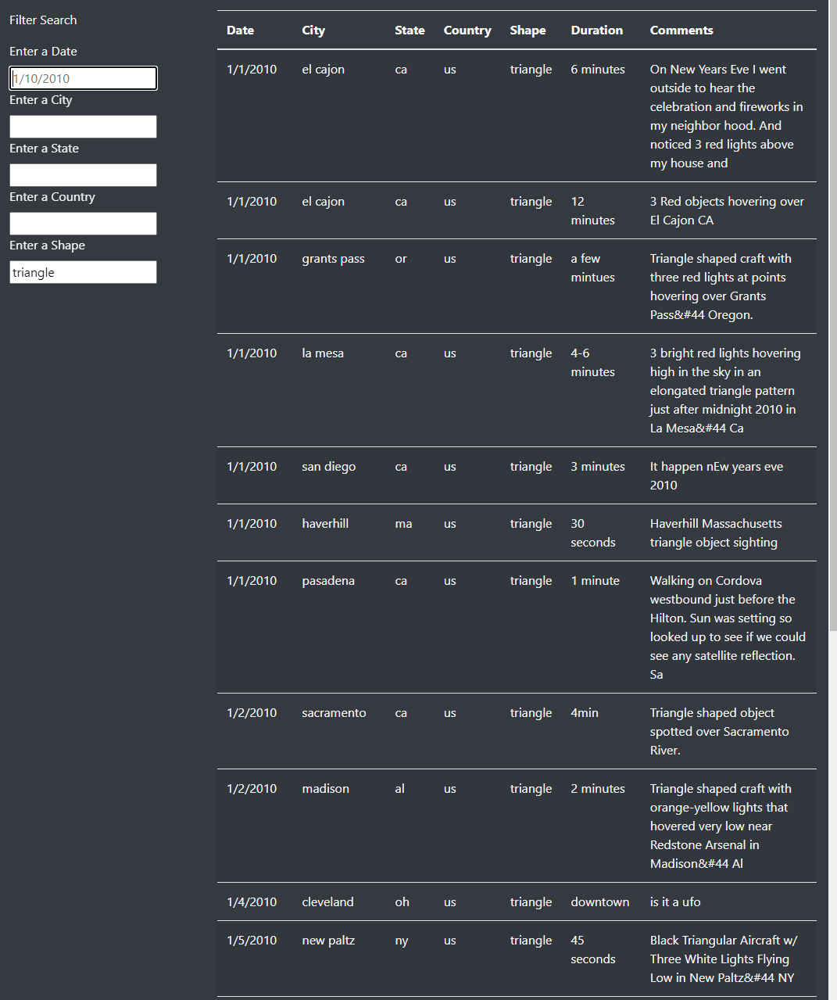
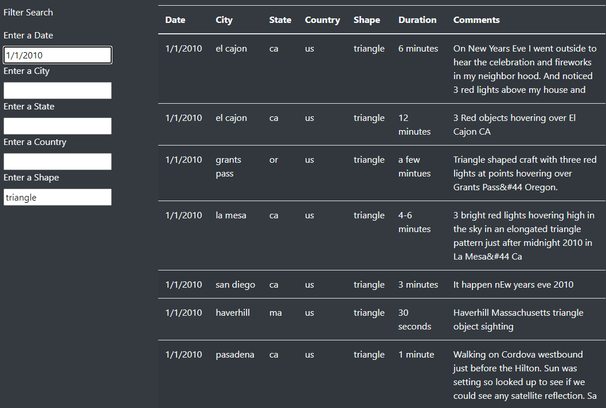
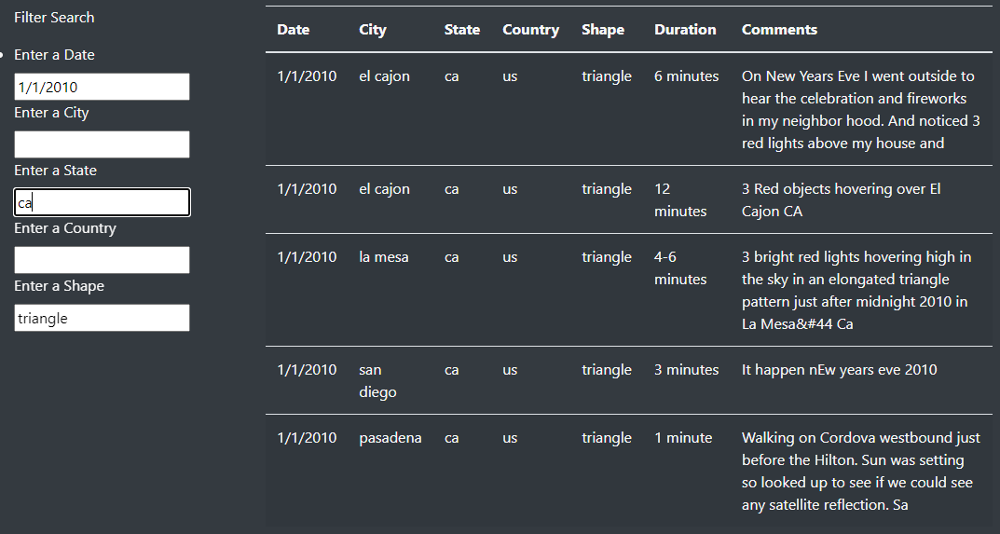
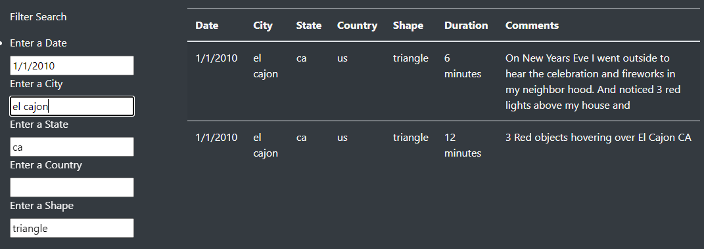

# UFOs
Module 11

## Overview

For this project, a dynamic table which uses an imported data file, was made and displayed on a webpage.  Based on input from the user, the table is filtered on one or more criteria including: date, city, state, country, and shape of the UFO event.  

## Results

The table may be filtered on one or more criteria by entering text into each search box as necessary.  The table will filter once the user clicks, tabs, or enters out of the current filter search field. There are examples of the filtered data table below.  

  - Unfiltered data (the date is a placeholder to show the date format for searching).
  
  
  
  - Filtered on shape only.
  
  
  
  - Filtered on shape and date.
  
  
  
  - Filtered on shape, date, and state.
  
  
  
  - Filtered on shape, date, state, and city.
  
  
  
## Summary
### Function and Recommendations
  
Overall the webpage is user friendly, but one draw back that is evident when performing a search is that the user must refresh the page in order to reset any of the filters that were in place if they wish to change them.  Based on that, one recommendation would be to add a "clear filters" button.  

Originally there were placeholders for all search parameters but it was confusing once a search was started to determine which parameters were chosen. Those were removed with the exception of the date format placeholder. It may even be more user friendly to add the format following the "Enter a Date" indicator as m/d/yyyy or make the date more flexible in the programming to accomodate for dates such as 01/01/2010.  It would also be beneficial to expand the data available for searching.  The current data encompasses a partial month in January 2010. 
